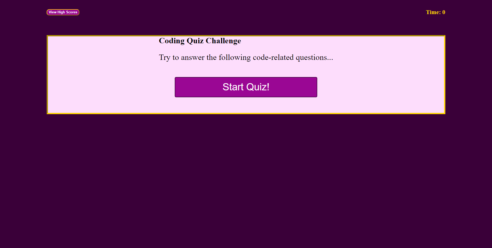

# Coding Quiz

The task for this project was to create a timed online quiz that creates and displays content dynamically.  The quiz consists of 5 questions, each question has 4 choices.  When a question is answered incorrectly, time is reduced.  The quiz ends when the timer reaches 0 or all questions have been answered.  At the end of the quiz you may choose to input your initials, or not.  When you view high scores, you see all the scores for that session displayed in a table format.

.
[my code repository](https://github.com/RelentlessNC/codingQuiz.git).
[my code's live URL](https://relentlessnc.github.io/codingQuiz/).

## User Story

```md
AS A coding boot camp student
I WANT to take a timed quiz on JavaScript fundamentals that stores high scores
SO THAT I can gauge my progress compared to my peers
```

## Acceptance Criteria

```md
GIVEN I am taking a code quiz
WHEN I click the start button
THEN a timer starts and I am presented with a question
WHEN I answer a question
THEN I am presented with another question
WHEN I answer a question incorrectly
THEN time is subtracted from the clock
WHEN all questions are answered or the timer reaches 0
THEN the game is over
WHEN the game is over
THEN I can save my initials and score
```

## Mock-Up

The following animation demonstrates the application functionality:

.
